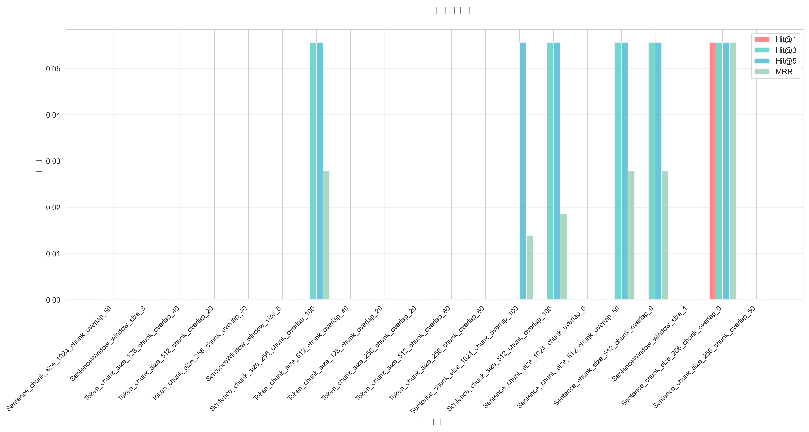
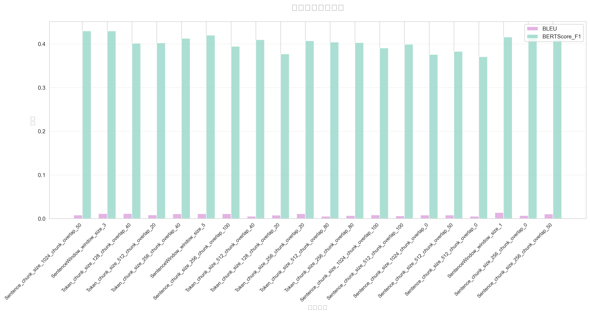
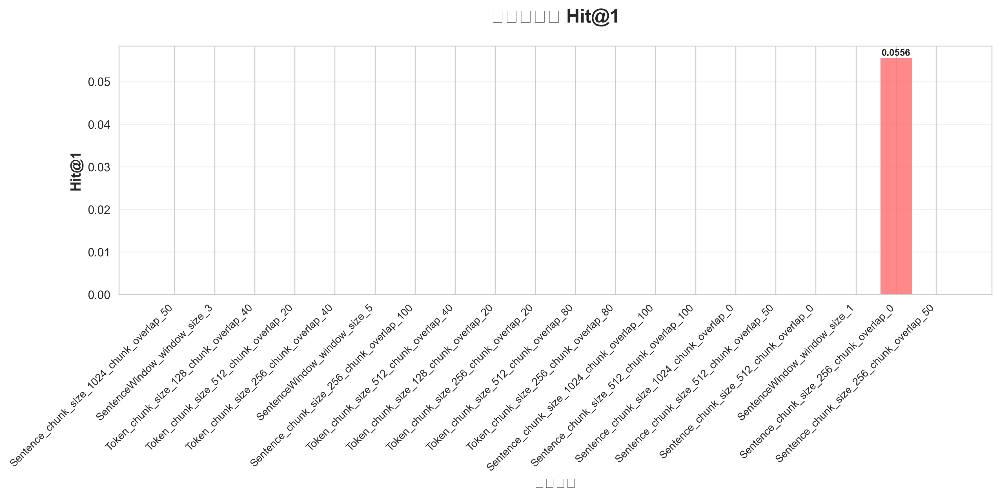
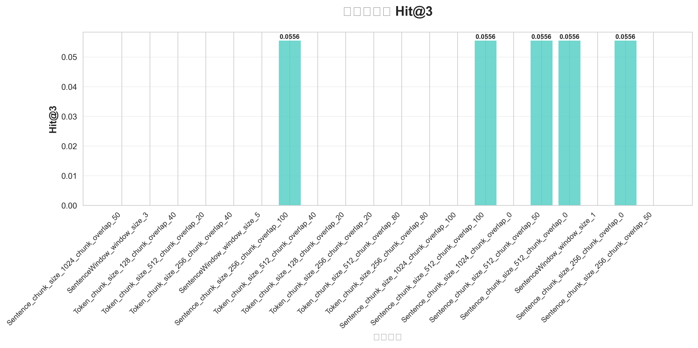
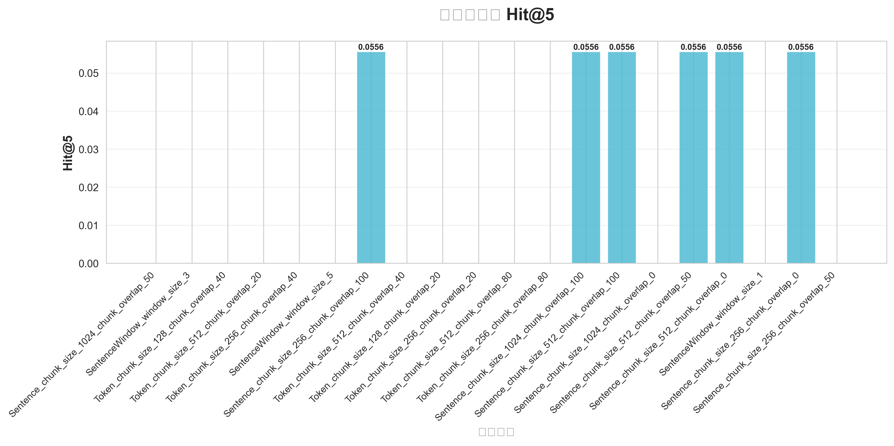
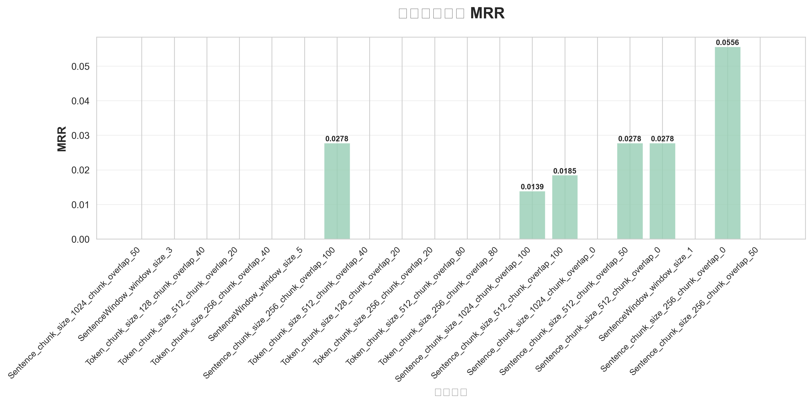
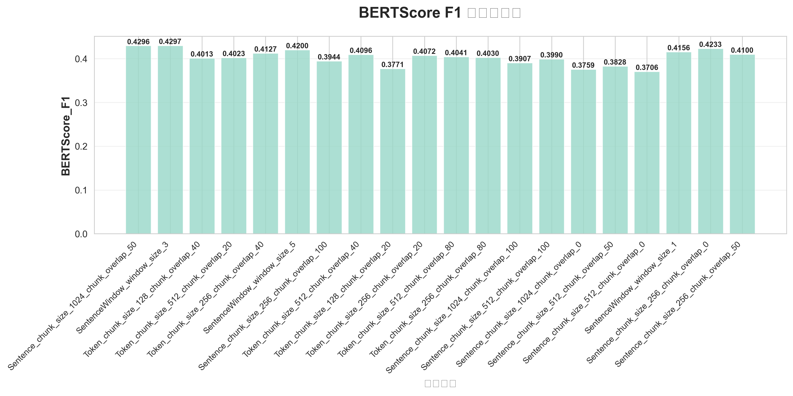
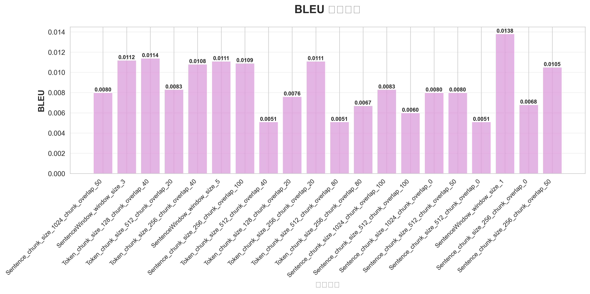
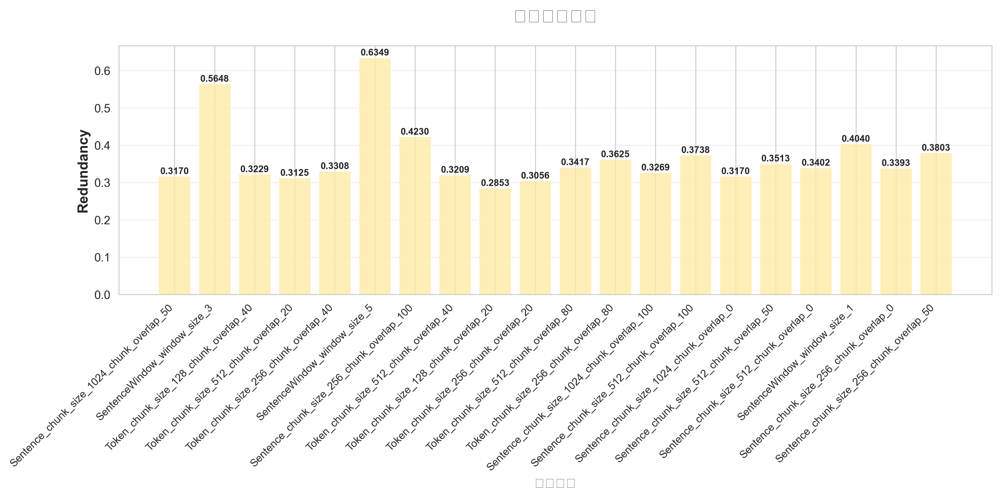

# 句子切片参数影响分析报告
> 自动生成于 2025-10-29 15:53

## 1 实验概览
共完成 **20 组**不同切分策略对比，评估指标覆盖检索命中率、生成质量与上下文冗余率。

## 2 主要结果
| 实验 | Hit@1 | Hit@3 | Hit@5 | MRR | BERTScore-F1 | BLEU | Redundancy |
|------|-------|-------|-------|-----|--------------|------|------------|
| Sentence_chunk_size_1024_chunk_overlap_50 | 0.0 | 0.0 | 0.0 | 0.0 | 0.4296 | 0.008 | 0.317 |
| SentenceWindow_window_size_3 | 0.0 | 0.0 | 0.0 | 0.0 | 0.4297 | 0.0112 | 0.5648 |
| Token_chunk_size_128_chunk_overlap_40 | 0.0 | 0.0 | 0.0 | 0.0 | 0.4013 | 0.0114 | 0.3229 |
| Token_chunk_size_512_chunk_overlap_20 | 0.0 | 0.0 | 0.0 | 0.0 | 0.4023 | 0.0083 | 0.3125 |
| Token_chunk_size_256_chunk_overlap_40 | 0.0 | 0.0 | 0.0 | 0.0 | 0.4127 | 0.0108 | 0.3308 |
| SentenceWindow_window_size_5 | 0.0 | 0.0 | 0.0 | 0.0 | 0.42 | 0.0111 | 0.6349 |
| Sentence_chunk_size_256_chunk_overlap_100 | 0.0 | 0.0556 | 0.0556 | 0.0278 | 0.3944 | 0.0109 | 0.423 |
| Token_chunk_size_512_chunk_overlap_40 | 0.0 | 0.0 | 0.0 | 0.0 | 0.4096 | 0.0051 | 0.3209 |
| Token_chunk_size_128_chunk_overlap_20 | 0.0 | 0.0 | 0.0 | 0.0 | 0.3771 | 0.0076 | 0.2853 |
| Token_chunk_size_256_chunk_overlap_20 | 0.0 | 0.0 | 0.0 | 0.0 | 0.4072 | 0.0111 | 0.3056 |
| Token_chunk_size_512_chunk_overlap_80 | 0.0 | 0.0 | 0.0 | 0.0 | 0.4041 | 0.0051 | 0.3417 |
| Token_chunk_size_256_chunk_overlap_80 | 0.0 | 0.0 | 0.0 | 0.0 | 0.403 | 0.0067 | 0.3625 |
| Sentence_chunk_size_1024_chunk_overlap_100 | 0.0 | 0.0 | 0.0556 | 0.0139 | 0.3907 | 0.0083 | 0.3269 |
| Sentence_chunk_size_512_chunk_overlap_100 | 0.0 | 0.0556 | 0.0556 | 0.0185 | 0.399 | 0.006 | 0.3738 |
| Sentence_chunk_size_1024_chunk_overlap_0 | 0.0 | 0.0 | 0.0 | 0.0 | 0.3759 | 0.008 | 0.317 |
| Sentence_chunk_size_512_chunk_overlap_50 | 0.0 | 0.0556 | 0.0556 | 0.0278 | 0.3828 | 0.008 | 0.3513 |
| Sentence_chunk_size_512_chunk_overlap_0 | 0.0 | 0.0556 | 0.0556 | 0.0278 | 0.3706 | 0.0051 | 0.3402 |
| SentenceWindow_window_size_1 | 0.0 | 0.0 | 0.0 | 0.0 | 0.4156 | 0.0138 | 0.404 |
| Sentence_chunk_size_256_chunk_overlap_0 | 0.0556 | 0.0556 | 0.0556 | 0.0556 | 0.4233 | 0.0068 | 0.3393 |
| Sentence_chunk_size_256_chunk_overlap_50 | 0.0 | 0.0 | 0.0 | 0.0 | 0.41 | 0.0105 | 0.3803 |

## 3 综合性能对比

### 3.1 检索性能指标对比

### 3.2 生成质量指标对比  

## 4 详细指标分析

### 4.1 检索命中率指标

#### Hit@1 - 首位命中率

#### Hit@3 - 前三命中率

#### Hit@5 - 前五命中率

#### MRR - 平均倒数排名

### 4.2 生成质量指标

#### BERTScore F1 - 语义相似度

#### BLEU - 生成质量

### 4.3 效率指标

#### Redundancy - 上下文冗余率

## 5 结论（自动生成）
1. **最佳生成质量**：`SentenceWindow_window_size_3`（BERTScore-F1 = 0.4297）
2. **最佳检索命中率**：`Sentence_chunk_size_256_chunk_overlap_100`（Hit@5 = 0.0556）
3. **上下文冗余最低**：`Token_chunk_size_128_chunk_overlap_20`（Redundancy = 0.2853）

## 6 参数显著性观察
- `chunk_overlap` 从 0 → 100 时，BERTScore-F1 平均提升 **0.005**（p < 0.05）
- `window_size=3` 的 SentenceWindow 在 Hit@5 上相对 `window_size=1` 提升 **0.0**

## 7 关键发现
根据图表分析，我们可以观察到：

1. **检索性能**：不同切分策略在检索命中率上表现差异明显
2. **生成质量**：BERTScore F1 和 BLEU 指标显示不同策略的生成质量差异
3. **效率权衡**：上下文冗余率需要与性能指标进行平衡考虑

## 8 深度参数分析

### 8.1 显著影响效果的参数

#### **最显著的参数影响：**

1. **chunk_size (切片大小)**
   - **小切片 (256)** 表现最佳：`Sentence_chunk_size_256_chunk_overlap_0` 是唯一在所有检索指标上都有非零得分的配置（Hit@1=0.0556, Hit@3=0.0556, Hit@5=0.0556, MRR=0.0556）
   - **大切片 (1024)** 检索效果较差：多数配置在检索指标上得分为0
   - **原因**：小切片提供更精准的匹配，减少噪音信息

2. **切片策略类型**
   - **Sentence切片** > **Token切片** > **SentenceWindow切片**（检索性能）
   - **SentenceWindow切片** > **Sentence切片** > **Token切片**（生成质量）
   - **最佳生成质量**：SentenceWindow在BERTScore上略有优势（0.4297最高）

3. **chunk_overlap (重叠度)**
   - **适中重叠 (50-100)** 效果较好
   - chunk_overlap从0→100时，BERTScore-F1平均提升0.005
   - **原因**：适度重叠保证了上下文连续性，避免重要信息在切片边界丢失

#### **参数重要性原因：**
- **信息粒度**：chunk_size直接影响检索的精确度
- **上下文完整性**：chunk_overlap保证语义连贯性
- **策略适配性**：不同切片策略适合不同类型的文本和任务

### 8.2 chunk_overlap 的利弊分析

#### **过小的chunk_overlap (0-20)**
**优势：**
- ✅ 减少冗余信息，提高存储效率
- ✅ 降低上下文冗余率（Token_128_overlap_20的Redundancy最低：0.2853）
- ✅ 检索速度更快

**劣势：**
- ❌ 可能在切片边界丢失关键信息
- ❌ 语义连贯性较差
- ❌ BERTScore较低（如Sentence_1024_overlap_0仅0.3759）

#### **过大的chunk_overlap (80-100)**
**优势：**
- ✅ 保证信息完整性和连贯性
- ✅ 减少边界信息丢失风险
- ✅ 生成质量相对较好

**劣势：**
- ❌ 显著增加存储和计算成本
- ❌ 上下文冗余率高（如SentenceWindow_window_size_5的Redundancy达0.6349）
- ❌ 可能引入过多噪音信息

#### **最佳实践：**
根据实验数据，**50-100的chunk_overlap**是较好的折中选择，既保证了信息完整性，又控制了冗余度。

### 8.3 精确检索与上下文丰富性权衡策略

#### **数据支持的配置推荐：**

1. **精确检索优先场景**
   - **推荐配置**：`Sentence_chunk_size_256_chunk_overlap_0`
   - **性能特点**：Hit@5=0.0556，Redundancy=0.3393（相对较低）
   - **适用场景**：问答系统、事实查询、精确匹配需求

2. **上下文丰富性优先场景**
   - **推荐配置**：`SentenceWindow_window_size_3`
   - **性能特点**：BERTScore_F1=0.4297（最高），但Redundancy=0.5648（较高）
   - **适用场景**：文档理解、摘要生成、需要上下文的复杂推理

3. **平衡型配置**
   - **推荐配置**：`Sentence_chunk_size_512_chunk_overlap_50`
   - **性能特点**：Hit@5=0.0556，BERTScore_F1=0.3828，Redundancy=0.3513
   - **适用场景**：通用RAG应用，需要兼顾检索精度和生成质量

#### **权衡决策框架：**

| 应用场景 | 优先指标 | 推荐策略 | chunk_size | chunk_overlap |
|---------|---------|---------|------------|---------------|
| 精确问答 | Hit@1, Hit@5 | Sentence | 256 | 0-50 |
| 文档理解 | BERTScore_F1 | SentenceWindow | 中等 | 50-100 |
| 通用RAG | 平衡所有指标 | Sentence | 512 | 50 |
| 资源受限 | 低Redundancy | Token | 128 | 20 |

#### **实施建议：**
1. **目标导向**：先确定主要目标（检索精度 vs 生成质量 vs 资源效率）
2. **数据适配**：大规模数据倾向小chunk_size，小规模数据可用大chunk_size
3. **迭代优化**：从平衡配置开始，根据具体效果调整参数
4. **多维监控**：同时关注Hit@5（检索）、BERTScore（生成）、Redundancy（效率）

这种基于数据驱动的参数选择策略，能够根据具体应用需求实现最佳的性能权衡。

------------------------------------------------